# ClimaRep: Estimating climate representativeness

<p align="center">
  
</p>

[](https://cran.r-project.org/package=ClimaRep)


## Overview

The `ClimaRep` package offers tools to analyze the climate representativeness of defined areas, assessing current conditions and evaluating how they are projected to change under future scenarios. 
Using spatial data, including climate raster layers, the input reference area polygons, and a polygon of the study area, the package quantifies this representativeness and analyzes its transformation.

Key features include:
* Filtering raster climate variables to reduce multicollinearity (`ClimaRep::vif_filter()`).
* Estimating current climate representativeness (`ClimaRep::mh_rep()`).
* Estimating changes in climate representativeness under future climate projections (`ClimaRep::mh_rep_ch()`).
* Estimating climate representativeness overlay (`ClimaRep::rep_overlay()`).

## Installation

You can install the development version of `ClimaRep` from CRAN with:
```{r}
install.packages("ClimaRep")
```
Alternatively, you can install the development version from GitHub:
```{r}
install.packages("devtools")
library(devtools)
devtools::install_github("MarioMingarro/ClimaRep")
```
Dependencies:

This package relies on other R packages, such as:

> `terra` for efficient handling of raster data (`SpatRaster` objects).

> `sf` for robust handling of vector data (`sf` objects).

> `stats` for statistical analysis.

> `ggplot2` and `tidyterra` for visualization tasks.

These dependencies will be installed automatically when you install `ClimaRep`.

## Getting started

This section provides a brief example demonstrating the core workflow of the package.

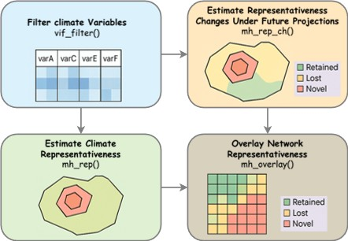


First, load the package:

```{r}
library(ClimaRep)
library(terra)
library(sf)
```
Next, prepare the essential input data:

1. **Climate variables** as an `SpatRaster` objects with consistent extent, resolution, and Coordinate Reference System (CRS).

2. **Polygon** as an `sf` object containing one or more polygons, with a column identifying each reference area (e.g., a 'name' or 'ID' column).

3. **Study area** as a single `sf` object, representing the overall geographical region for analysis and thus the climate space being worked on.


Here is a practical example using simulated data:

The example simulates a pair of reference `polygon` and assesses their climate representativeness and change, based on Mahalanobis Distance.

This involves creating a simulated climate space within which the analysis is performed.

Generate simulated climate raster layers:

```{r}
set.seed(2458)
n_cells <- 100 * 100
r_clim_present <- terra::rast(ncols = 100, nrows = 100, nlyrs = 7)
values(r_clim_present) <- c(
  (rowFromCell(r_clim_present, 1:n_cells) * 0.2 + rnorm(n_cells, 0, 3)),
  (rowFromCell(r_clim_present, 1:n_cells) * 0.9 + rnorm(n_cells, 0, 0.2)),
  (colFromCell(r_clim_present, 1:n_cells) * 0.15 + rnorm(n_cells, 0, 2.5)),
  (colFromCell(r_clim_present, 1:n_cells) + 
     rowFromCell(r_clim_present, 1:n_cells) * 0.1 + rnorm(n_cells, 0, 4)),
  (colFromCell(r_clim_present, 1:n_cells) /
     rowFromCell(r_clim_present, 1:n_cells) * 0.1 + rnorm(n_cells, 0, 4)),
  (colFromCell(r_clim_present, 1:n_cells) *
     (rowFromCell(r_clim_present, 1:n_cells) + 0.1 + rnorm(n_cells, 0, 4))),
  (colFromCell(r_clim_present, 1:n_cells) *
     (colFromCell(r_clim_present, 1:n_cells) + 0.1 + rnorm(n_cells, 0, 4))))
names(r_clim_present) <- c("varA", "varB", "varC", "varD", "varE", "varF", "varG")
terra::crs(r_clim_present) <- "EPSG:4326"
terra::plot(r_clim_present)
```
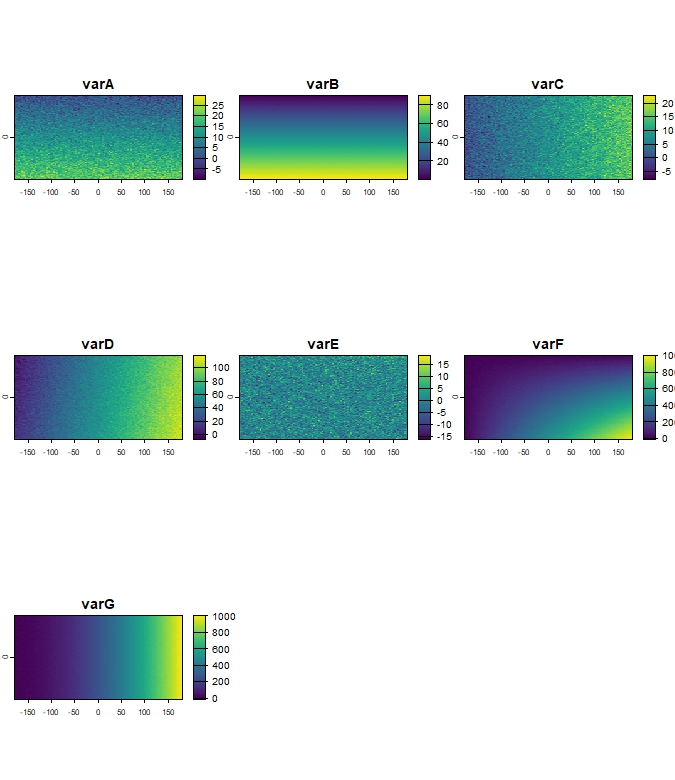

*Figure 1: Example of simulated climate raster layers (`r_clim_present`).*


### 1. Filter climate variables

Multicollinearity among climate variables can affect multivariate analyses.

To handle this, the `ClimaRep::vif_filter()` function can be used to iteratively remove variables with a Variance Inflation Factor (VIF) above a specified threshold (e.g., `th = 5`).

The output returns a `list` object with:
- A filtered `SpatRaster` object containing only the variables that were kept 
- A comprehensive statistics summary `list` including:
  - The name of variables that were kept and those that were excluded.
  - The original Pearson's correlation matrix between all initial variables.
  - The final VIF values for the variables that were retained.


```{r}
vif_result <- vif_filter(r_clim_present, th = 5)
print(vif_result$summary)

Kept layers: varA, varC, varE, varF, varG 
Excluded layers: varD, varB 

Pearson correlation matrix of original data:
        varA    varB   varC   varD    varE    varF   varG
varA  1.0000  0.8870 0.0087 0.0938 -0.0745  0.5816 0.0028
varB  0.8870  1.0000 0.0043 0.0997 -0.0769  0.6513 0.0003
varC  0.0087  0.0043 1.0000 0.8523  0.0517  0.5676 0.8341
varD  0.0938  0.0997 0.8523 1.0000  0.0576  0.7077 0.9529
varE -0.0745 -0.0769 0.0517 0.0576  1.0000 -0.0256 0.0653
varF  0.5816  0.6513 0.5676 0.7077 -0.0256  1.0000 0.6305
varG  0.0028  0.0003 0.8341 0.9529  0.0653  0.6305 1.0000

Final VIF values for kept variables:
        VIF
varA 2.2832
varC 3.3473
varE 1.0121
varF 3.8325
varG 4.3545

r_clim_present_filtered <- vif_result$filtered_raster
terra::plot(r_clim_present_filtered)
```
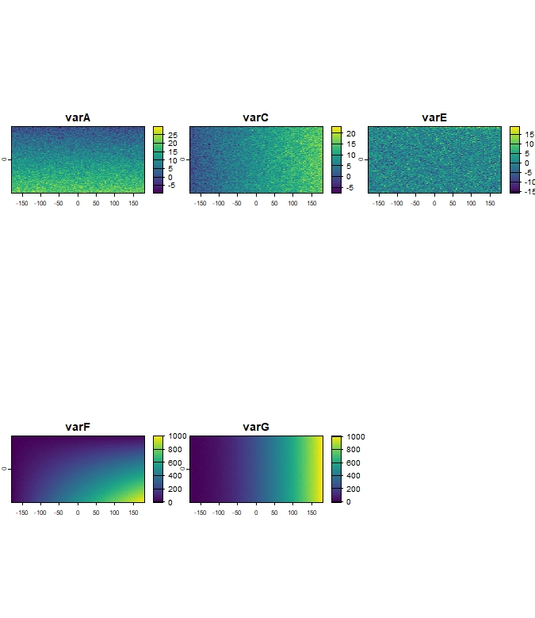

*Figure 2: Example of filtered climate dataset, showing remaining variables (`r_clim_present_filtered`) after `ClimaRep::vif_filter()`.*

### 2. Estimate climate representativeness
Create example reference `polygon` (`sf`) to estimate climate representativeness and a `study_area` polygon (`sf`) to set the climate space for analysis:
```{r}
hex_grid <- sf::st_sf(
  sf::st_make_grid(
    sf::st_as_sf(
      terra::as.polygons(
        terra::ext(r_clim_present))), 
  square = FALSE))
sf::st_crs(hex_grid) <- "EPSG:4326"
polygons <- hex_grid[sample(nrow(hex_grid), 2), ]
polygons$name <- c("Pol_1", "Pol_2")
sf::st_crs(polygons) <- sf::st_crs(hex_grid)
study_area_polygon <- sf::st_as_sf(as.polygons(terra::ext(r_clim_present)))
sf::st_crs(study_area_polygon) <- "EPSG:4326"
terra::plot(r_clim_present[[1]])
terra::plot(polygons, add = TRUE, color= "transparent", lwd = 3)
terra::plot(study_area_polygon, add = TRUE, col = "transparent", lwd = 3, border = "red")
```
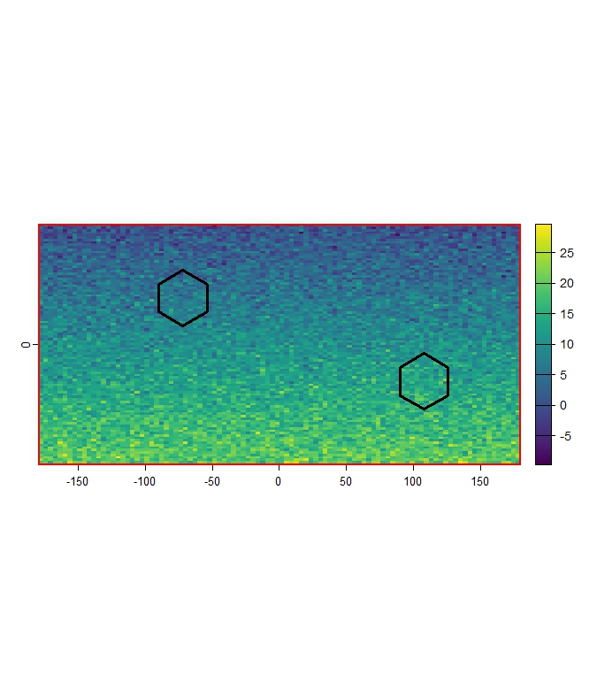

*Figure 3: Example of reference polygons (black outline) and study area (red outline) overlaid on `r_clim_present_filtered[[1]]`.*

Use `ClimaRep::mh_rep()` to estimate climate representativeness for each reference `polygon`. 

The function calculates the Mahalanobis Distance from the multivariate centroid of climate conditions within each reference `polygon` to all cells in the `study_area`. 

Cells within a certain percentile threshold (`th`) of distances found within the reference `polygon` are considered representative of the climate of the `polygon`.

```{r}
mh_rep(
  polygon = polygons,
  col_name = "name",
  climate_variables = r_clim_present_filtered,
  study_area = study_area_polygon,
  th = 0.95,
  dir_output = tempdir(),
  save_raw = TRUE)
  
----------------------------
Validating and adjusting Coordinate Reference Systems (CRS)
Starting per-polygon processing:

Processing polygon: pol_1 (1 of 2)

Processing polygon: pol_1 (2 of 2)

All processes were completed

Output files in: C:\Users\AppData\Local\Temp\RtmpY1rKKD
----------------------------

```
This process generates 3 subfolders within the directory specified by `dir_output` (e.g., `tempdir()`).
```{r}
list.files(tempdir())
 [1] "Charts"             "Mh_Raw"             "Representativeness"
```

1. The `Charts` subfolder contains the binary representativeness image files (`.jpeg`) for each reference `polygon`.

```{r}
list.files(file.path(tempdir(), "Charts"))
[1] "pol_1_rep.jpeg" "pol_2_rep.jpeg"
```
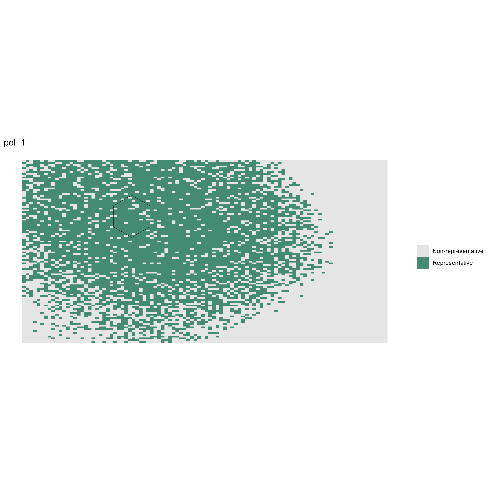

*Figure 4: Example of binary representativeness map for Pol_1 (pol_1_rep.jpeg).*

2. The `Mh_raw` subfolder contains the continuous Mahalanobis Distance rasters (`.tif`) for each reference `polygon`. 

Lower values indicate climates more similar to the reference polygon's centroid.

```{r}
mh_rep_raw <- terra::rast(list.files(file.path(tempdir(), "Mh_Raw"),  pattern = "\\.tif$", full.names = TRUE))
terra::plot(mh_rep_raw[[1]])
terra::plot(polygons[1,], add = TRUE, color= "transparent", lwd = 3)
```
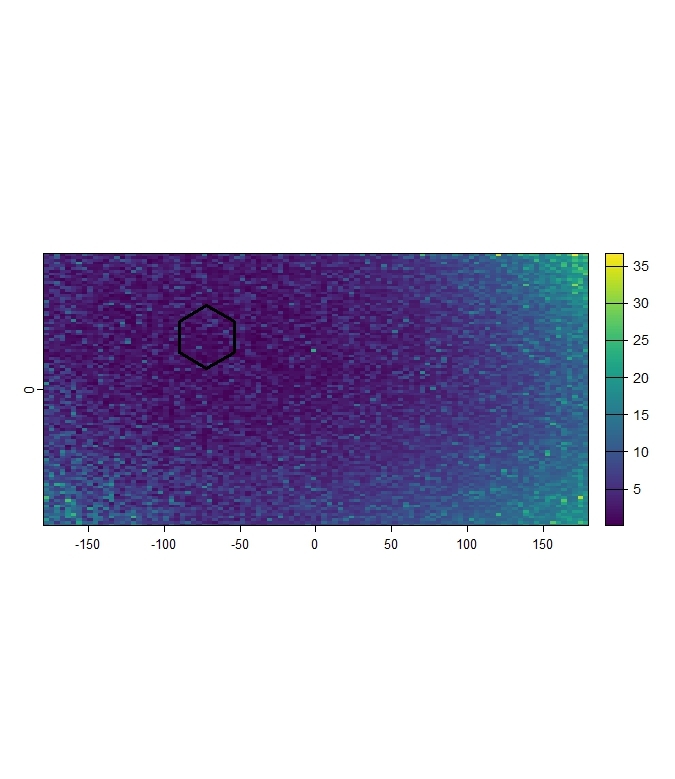

*Figure 5: Example of continuous Mahalanobis Distance raster for Pol_1. Darker shades indicate cells with climate conditions more similar to Pol_1.*

3. The `Representativeness` subfolder contains the binary representativeness rasters (`.tif`) for each reference `polygon`, based on the threshold (`th`) applied to the raw Mahalanobis Distance.

Cells are coded `1` for `Representative` and `0` for `Unsuitable`.

```{r}
mh_rep_result <- terra::rast(list.files(file.path(tempdir(), "Representativeness"),  pattern = "\\.tif$", full.names = TRUE))
terra::plot(mh_rep_result[[1]])
terra::plot(polygons[1,], add = TRUE, color= "transparent", lwd = 3)
```

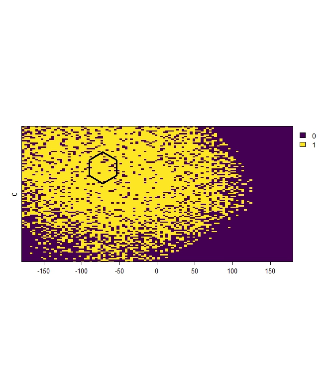

*Figure 6: Example of binary representativeness raster for Pol_1, showing cells classified as representetive (value 1).*

### 3. Estimate change in climate representativeness.
To estimate how representativeness changes, a future climate scenario is required.

In this example, a simple virtual future climate conditions (`SpatRaster`) are created by adding a constant value to the `r_clim_present_filtered` data:

```{r}
r_clim_future <- r_clim_present_filtered + 2 
names(r_clim_future) <- names(r_clim_present_filtered)
terra::crs(r_clim_future) <- terra::crs(r_clim_present_filtered)
terra::plot(r_clim_future)
```


*Figure 7: Example of simulated future climate variables (`r_clim_future`).*

Use `ClimaRep::mh_rep_ch()` to compare representativeness of a reference `polygon`, between the `present_climate_variables` and `future_climate_variables`. 

This function calculates representativeness for each reference `polygon` in both scenarios and determines cells where conditions:

- **Stable** - Climate conditions that exist in both the current and future scenarios.
- **Lost** - Climate conditions that exist now but are no longer present in the future.
- **Novel** - Climate conditions that are new and only appear in the future scenario.

```{r}
mh_rep_ch(
polygon = polygons,
col_name = "name",
present_climate_variables = r_clim_present_filtered,
future_climate_variables = r_clim_future,
study_area = study_area_polygon,
th = 0.95,
model = "MODEL",
year = "2070",
dir_output = tempdir(),
save_raw = TRUE)

Validating and adjusting Coordinate Reference Systems (CRS).
Starting per-polygon processing:

Processing polygon: pol_1 (1 of 2)

Processing polygon: pol_2 (2 of 2)

All processes were completed

Output files in:  C:\Users\AppData\Local\Temp\RtmpY1rKKD

```

This process generates several subfolders within the directory specified by `dir_output`.

```{r}
list.files(tempdir())
 [1] "Change"             "Charts"             "Mh_Raw_Pre"             "Mh_Raw_Fut"

```

The `Change` subfolder contains binary rasters (`.tif`) for each reference `polygon`, indicating the category of change.

- **0** - Unsuitable 
- **1** - Stable
- **2** - Lost
- **3** - Novel

```{r}
change_result <- terra::rast(list.files(file.path(tempdir(), "Change"),  pattern = "\\.tif$", full.names = TRUE))
terra::plot(change_result[[2]])
terra::plot(polygons[2,], add = TRUE, color= "transparent", lwd = 3)
```
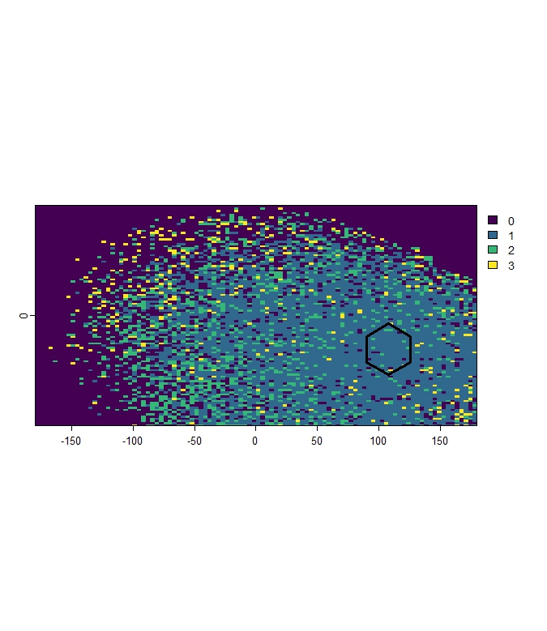

*Figure 8: Example of change in representativeness for Pol_2, showing areas Unsuitable (0), Stable (1), Lost (2), Novel (3).*

The `Charts` subfolder is updated or regenerated and contains summary map files (`.jpeg`) visualizing the change analysis results for each reference `polygon`.

```{r}
list.files(file.path(tempdir(), "Charts"))
[1] "pol_1_rep_change.jpeg" "pol_2_rep_change.jpeg"
```
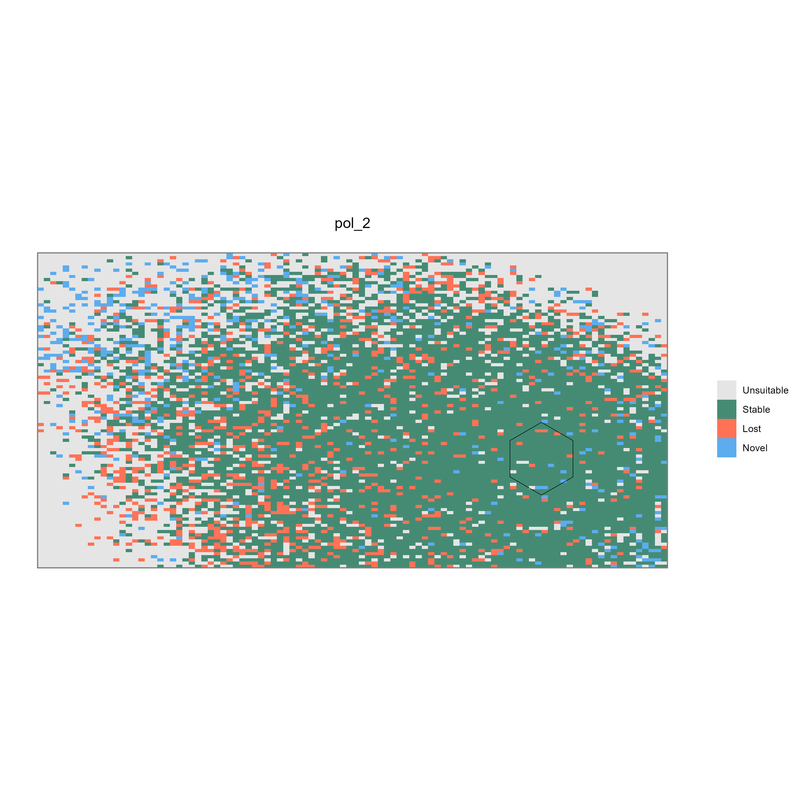

*Figure 9: Example of summary maps illustrating climate representativeness change for Pol_2 (`pol_2_rep_change.jpeg`).*

The `Mh_Raw_Pre` subfolder contains the continuous Mahalanobis Distance rasters (`.tif`) for the **present** scenario, calculated within the `study_area` extent relative to the climate conditions within each reference `polygon`.

```{r}
Mh_raw_Pre_result <- terra::rast(list.files(file.path(tempdir(), "Mh_Raw_Pre"),  pattern = "\\.tif$", full.names = TRUE))
terra::plot(Mh_raw_Pre_result[[2]])
terra::plot(polygons[2,], add = TRUE, color= "transparent", lwd = 3)
```

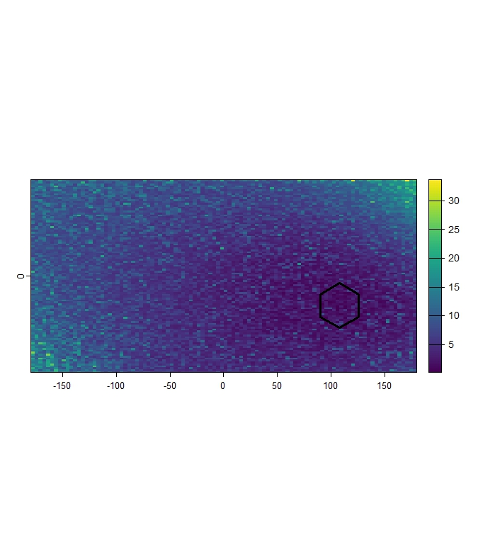

*Figure 10: Example continuous present Mahalanobis Distance raster (within study area) for Pol_2.*

The `Mh_Raw_Fut` subfolder contains the continuous raw Mahalanobis Distance rasters (`.tif`) for the **future** scenario, calculated within the `study_area` extent relative to the climate conditions within each reference `polygon`.

```{r}
Mh_raw_Fut_result <- terra::rast(list.files(file.path(tempdir(), "Mh_Raw_Fut"),  pattern = "\\.tif$", full.names = TRUE))
terra::plot(Mh_raw_Fut_result[[2]])
terra::plot(polygons[2,], add = TRUE, color= "transparent", lwd = 3)
```

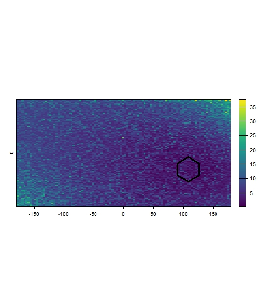

*Figure 11: Example continuous future Mahalanobis Distance raster for Pol_2.*

### 4. Estimate environmental representativeness overlay.
After obtaining the representativeness (`ClimaRep::mh_rep()`),  or change (`ClimaRep::mh_rep_ch()`), rasters for multiple reference `polygons`, it is possible to combine them and to identify where the different types of changes (representative/stable, lost, novel) are accumulated. 

The `ClimaRep::rep_overlay()` function counting, for each cell, how many of the input rasters had a specific category value at that location.

```{r}
ClimaRep_overlay <- rep_overlay(folder_path = file.path(tempdir(), "Change"),
                               output_dir = file.path(tempdir(), "ClimaRep_overlay"))

Processing 2 classification rasters from C:\Users\AppData\Local\Temp\RtmpY1rKKD/Change
Calculating counts for category: Lost (value = 2) 
Calculating counts for category: Stable (value = 1) 
Calculating counts for category: Novel (value = 3) 
All processes were completed
Output files saved in:  C:\Users\AppData\Local\Temp\RtmpY1rKKD/ClimaRep_overlay

terra::plotRGB(ClimaRep_overlay, stretch = "lin")
```

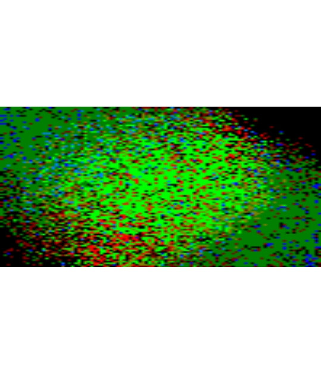

*Figure 12: Visualisation of accumulated Lost (R), Stable (G) and Novel (B) cells for both reference `polygon`.*


```{r}
terra::plot(ClimaRep_overlay)
```

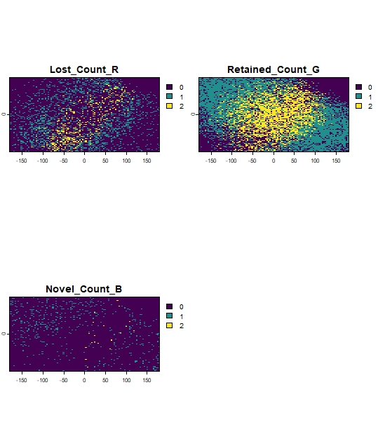

*Figure 13: Example of accumulate Lost (1), Stable (2) or Novel (3) cells for both reference `polygon`.*


## Functions reference

**ClimaRep::vif_filter()**

This function iteratively filters layers from a `SpatRaster` object by removing the one with the highest Variance Inflation Factor (VIF) that exceeds a specified threshold (`th`).

`ClimaRep::vif_filter(x, th)`

> `x`: A `SpatRaster` object with climate layers.

> `th`: The VIF `threshold`.

**ClimaRep::mh_rep()**

This function calculates climate representativeness for each reference polygon within a defined area.

Representativeness is assessed by comparing the multivariate climate conditions of each cell, of the reference climate space (`climate_variables`), with the climate conditions within each specific reference `polygon`. The CRS of `polygon` will be used as the reference system.

`ClimaRep::mh_rep(polygon, col_name, climate_variables, th, dir_output, save_raw)`

> `polygon`: An `sf` object containing the input polygon(s) for which representativeness will be assessed.

> `col_name`: The `name` of the column in `polygon` that contains unique identifiers for each reference `polygon`.

> `climate_variables`: A `SpatRaster` object with the climate layers (pre-filtered using `vif_filter`).

> `study_area`: An `sf` object defining the overall study region.

> `th`: The `threshold` for determining representativeness (e.g., 0.9 for the 90th percentile of distances within the reference `polygon`).

> `dir_output`: Path to the `directory` where output rasters and charts will be saved. The directory will be created if it doesn't exist.

> `save_raw`: Logical. If `TRUE`, saves the continuous Mahalanobis Distance raster (`Mh_raw`) for each reference `polygon`.

**ClimaRep::mh_rep_ch()**

This function calculates climate representativeness for each reference polygon across two time periods (present and future) within a defined area.

The function identifies areas of climate representativeness Stable, Lost, or Novel.

Representativeness change is assessed by comparing the multivariate climate conditions of each cell, of the reference climate space (`present_climate_variables` and `future_climate_variables`), with the climate conditions within each specific reference `polygon`. The CRS of `polygon` will be used as the reference system.

`ClimaRep::mh_rep_ch(polygon, col_name, present_climate_variables, future_climate_variables, study_area, th, model, year, dir_output, save_raw)`

> `polygon`: An `sf` object containing the input polygon/s for which representativeness change will be assessed.

> `col_name`: The `name` of the column in `polygon` that contains unique identifiers for each reference `polygon`.

> `present_climate_variables`: A `SpatRaster` object with the present climate layers (pre-filtered using `vif_filter`).

> `future_climate_variables`: A `SpatRaster` object with the future climate layers (usually same as `present_climate_variables`).

> `study_area`: An `sf` object defining the overall study region.

> `th`: The percentile `threshold` for determining representativeness in both scenarios (e.g., 0.9 for the 90th percentile of distances within the reference `polygon`).

> `model`: `Character string` identifying the climate model (e.g., "MIROC6"). This is used in output filenames for clear identification.

> `year`: `Character string` identifying the future period (e.g., "2050"). This is used in output filenames for clear identification.

> `dir_output`: Path to the `directory` where output rasters and charts will be saved. The directory will be created if it doesn't exist.

> `save_raw`: Logical. If `TRUE`, saves the continuous Mahalanobis Distance rasters (`Mh_raw`) for both present and future scenarios within the study area extent.

**ClimaRep::rep_overlay()**

Combines multiple single-layer rasters (`tif`), outputs from `ClimaRep::mh_rep()` or `ClimaRep::mh_rep_ch()` for different input polygons, into a multi-layered `SpatRaster`.

This function handles inputs from both `ClimaRep::mh_rep()` (which contains representetive and unsuitable cells) and `ClimaRep::mh_rep_ch()` (which includes Stable, Lost, and Novel cells). 
The output layers consistently represent the accumulation of each input.

`ClimaRep::rep_overlay(folder_path, dir_output)`

> `folder_path`: `Character string`. Path to the directory containing the input single-layer GeoTIFF classification rasters (outputs from `ClimaRep::mh_rep_ch()` or `ClimaRep::mh_rep()`).
> `dir_output`: Path to the `directory` where output rasters will be saved. The directory will be created if it doesn't exist.

## Citation

If the package itself is formally cited (e.g., on CRAN), please include the package citation as well:

> Mingarro & Lobo (2021) Connecting protected areas in the Iberian peninsula to facilitate climate change tracking. *Environmental Conservation*, 48(3): 182-191. doi:10.1017/S037689292100014X

> Mingarro, Aguilera-Benavente & Lobo (2020) A methodology to assess the future connectivity of protected areas by combining climatic representativeness and land-cover change simulations: the case of the Guadarrama National Park (Madrid, Spain). *Environmental Planning and Management*, 64(4): 734–753. doi.org/10.1080/09640568.2020.1782859

> Mingarro & Lobo (2018) Environmental representativeness and the role of emitter and recipient areas in the future trajectory of a protected area under climate change. *Animal Biodiversity and Conservation*, 41(2): 333–344. doi.org/10.32800/abc.2018.41.0333

> Farber & Kadmon (2003) Assessment of alternative approaches for bioclimatic modeling with special emphasis on the Mahalanobis Distance. *Ecological Modelling*, 160: 115–130. doi:10.1016/S0304-3800(02)00327-7 


## Getting help

If you encounter issues or have questions, please contact.


## License

MIT, GPL-3


